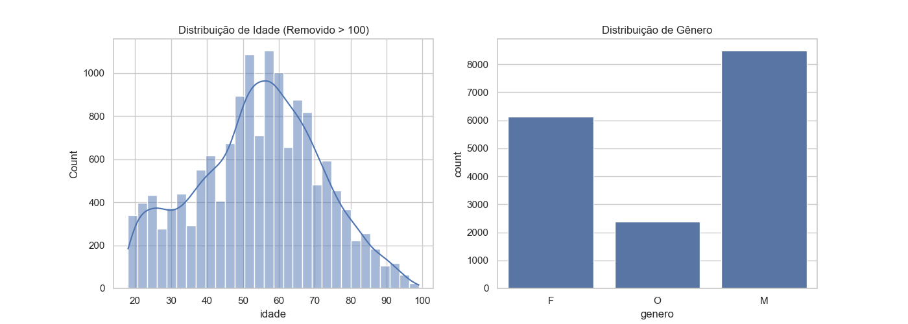
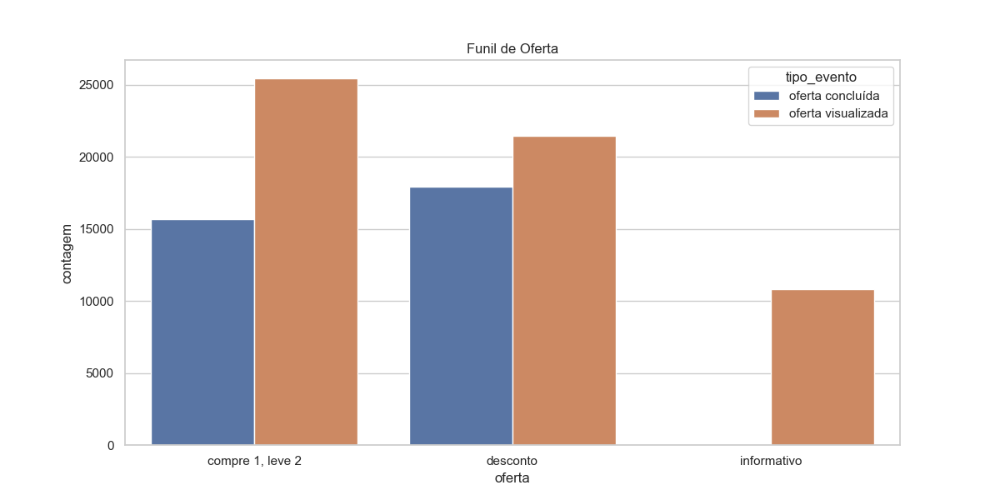
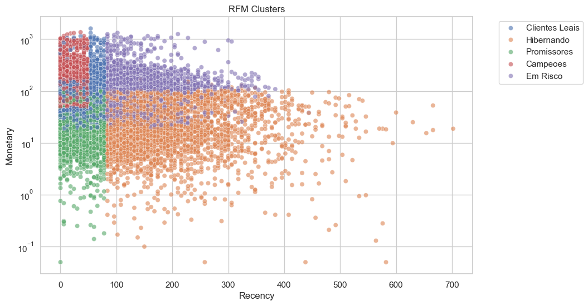
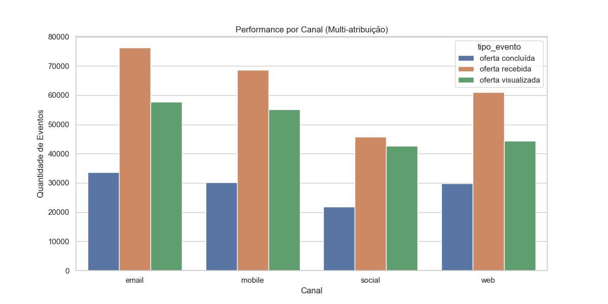

# Visualizações Geradas

Este documento apresenta as visualizações geradas pelo pipeline de análise de dados, acompanhadas de insights extraídos.

## 1. Demografia dos Clientes
A distribuição demográfica nos ajuda a entender quem são nossos clientes.

**Insights:**
*   **Idade:** A distribuição de idade (filtrada para < 100 anos) geralmente revela se o público é mais jovem, de meia-idade ou idoso. Entender a faixa etária predominante é crucial para ajustar a linguagem e o tom das campanhas.
*   **Gênero:** A contagem por gênero mostra a proporção entre homens, mulheres e outros. Isso pode indicar se há um viés de gênero na base de clientes que deve ser considerado na personalização das ofertas.

## 2. Funil de Conversão
O funil mostra a eficácia das ofertas desde a visualização até a conclusão.

**Insights de Conversão (Dados do Pipeline):**
*   **Taxas de Conversão por Canal:**
    *   **Web:** ~67% (O canal mais eficiente)
    *   **Email:** ~58%
    *   **Mobile:** ~54%
    *   **Social:** ~51%
*   **Performance das Ofertas:** Ofertas de "Desconto" e "Compre 1, Leve 2" são as maiores geradoras de receita.
*   **Nota sobre 'Informativo':** Ofertas do tipo "Informativo" não possuem eventos de conclusão ('oferta concluída'), pois são apenas para conscientização e não requerem uma transação específica para serem "completadas". Por isso, a taxa de conversão direta no funil aparece nula, o que é o comportamento esperado.
*   **Análise:** O gráfico de barras compara visualizações com conclusões. A diferença entre as barras indica a taxa de queda (drop-off). Ofertas com alta visualização mas baixa conclusão podem indicar problemas na mecânica da oferta ou na atratividade da recompensa.

## 3. Clusters RFM (Segmentação)
A segmentação RFM (Recência, Frequência, Valor Monetário) agrupa clientes baseados em seu comportamento de compra.

**Distribuição dos Segmentos:**
O gráfico de dispersão (Scatter Plot) visualiza os clientes nos eixos de Recência e Valor Monetário (escala logarítmica).
*   **Campeões (~3.000 clientes):** Alta recência e alto valor. Devem ser recompensados para manter a lealdade.
*   **Clientes Leais (~3.700 clientes):** Compram com frequência.
*   **Promissores (~3.100 clientes):** Têm potencial para se tornarem leais se incentivados corretamente.
*   **Em Risco (~2.700 clientes):** Clientes valiosos que não compram há algum tempo. Necessitam de campanhas de reativação urgentes.
*   **Hibernando (~3.800 clientes):** Baixa recência e baixo valor. O foco deve ser baixo custo de reativação ou ignorar se o ROI for negativo.

## 4. Performance por Canal (Atribuição Múltipla)
Como a base de dados não especifica qual canal *exato* gerou a visualização ou compra (apenas quais canais a oferta *tinha* disponíveis), utilizamos uma abordagem de multi-atribuição.

**Interpretação:**
*   **Alcance:** O email é o canal com maior volume de ofertas visualizadas (quando disponível).
*   **Conversão Relativa:** Web parece ter uma proporção melhor entre visualização e conclusão (barras mais próximas) do que Social, que tem muitos eventos mas proporcionalmente menos conclusões.
*   **Nota Técnica:** Se uma oferta está disponível em [Email, Web] e é visualizada, contamos +1 para Email e +1 para Web. Portanto, a soma dos eventos aqui é maior que o total de eventos únicos no funil.

